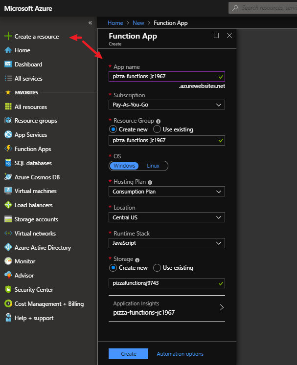
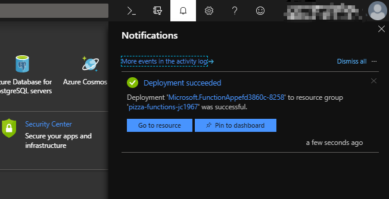
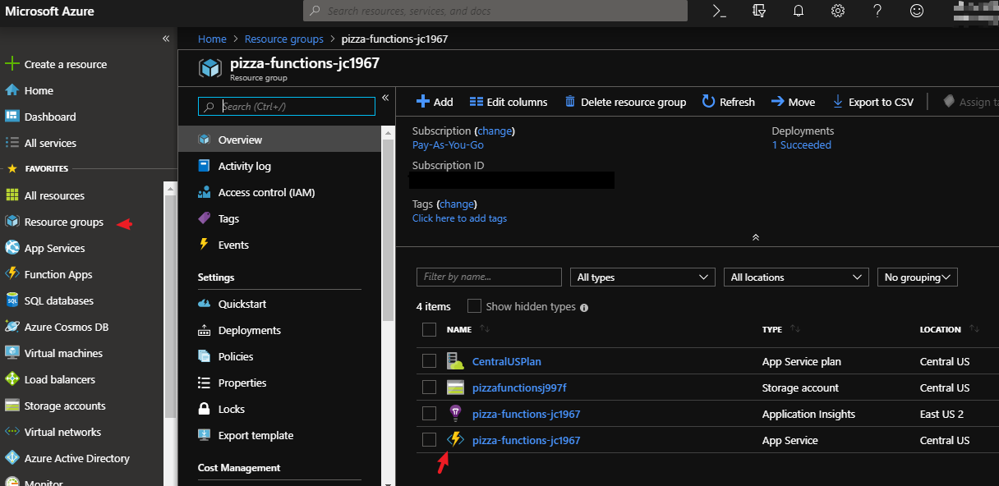
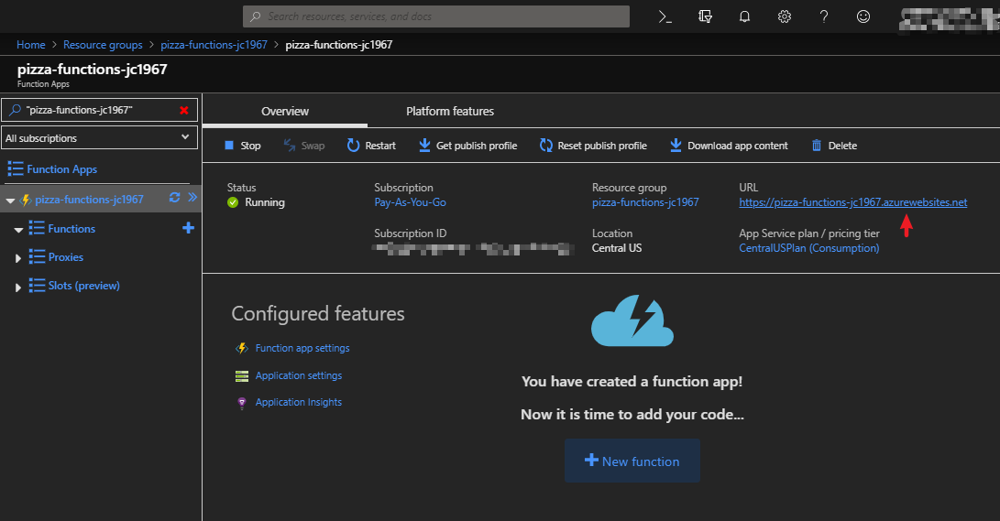
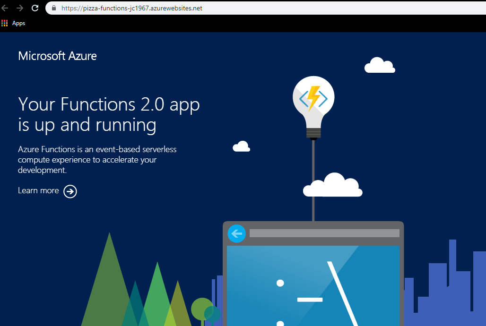
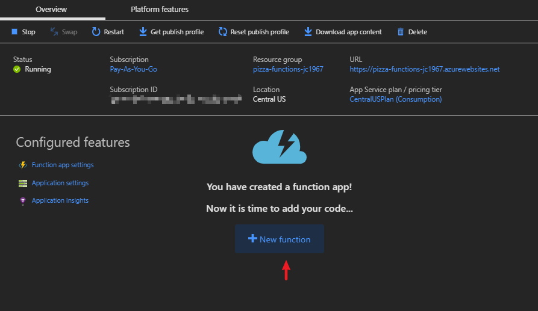
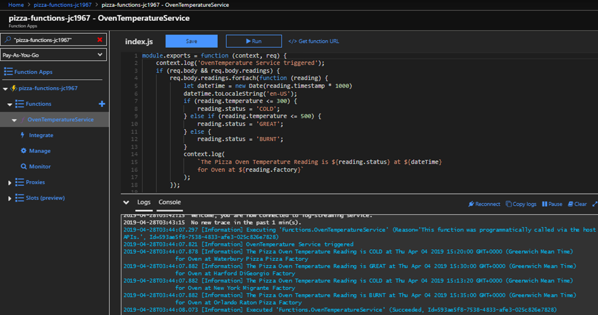
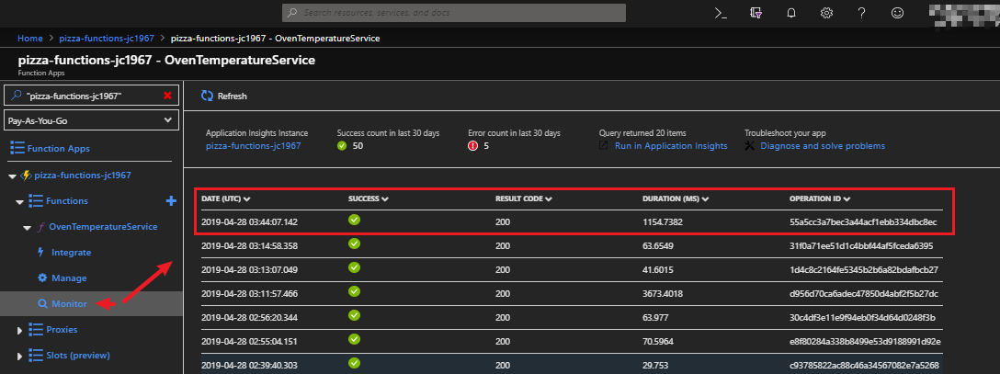

# Play and Test Your First Serverless Azure Function <!-- omit in toc -->

- [Scenario](#scenario)
- [What Is Serverless Computing](#what-is-serverless-computing)
  - [Here Are Some Benefits of Serverless Computing](#here-are-some-benefits-of-serverless-computing)
  - [What Are Azure Functions](#what-are-azure-functions)
- [Ready to play](#ready-to-play)
  - [Let Us Create a Function App](#let-us-create-a-function-app)
    - [Triggers](#triggers)
    - [Bindings](#bindings)
    - [There Are Two Kinds of Binding](#there-are-two-kinds-of-binding)
  - [Verify Your Function App Was Created](#verify-your-function-app-was-created)
  - [Test Your Template Function](#test-your-template-function)
- [Requirements for Your Function](#requirements-for-your-function)
  - [Add Your Code to the Function](#add-your-code-to-the-function)
  - [Let Us Test Our Own Logic](#let-us-test-our-own-logic)
- [Summary](#summary)
- [Technology](#technology)
- [Contributing](#contributing)
- [Contact / Social Media](#contact--social-media)
  - [License](#license)

## Scenario

Here is a scenario; you oversee an Oven Temperature Data Logger for a Pizzeria company. You monitor this data to help determine when oven maintenance is required.

Your company receives sensor data from several pizzeria factories and from different oven models. You are tasked to develop a reusable service that can process your temperature data from all these factories.

You decided the best and most cost-effective way to handle this task is to use serverless computing. For this project, you are going to use Azure Functions. With this in mind, we are going to play with Azure Functions to learn how it works immediately.

## What Is Serverless Computing

With serverless computing, your cloud provider manages the provisioning and maintenance of the infrastructure letting you focus on building the app logic. It enables you to run pieces of code or functions, written in the programming language of your choice, in the cloud. In other words, Function as a service (FaaS), or a microservice that is hosted on a cloud. Your function app is automatically scaled up or down depending on load.

### Here Are Some Benefits of Serverless Computing

* Write your own business logic in the language code of your choice
* You do not need to manage any servers hardware or resources
* You are charged based on what is used and not on reserved time
* You can avoid over-allocation of your infrastructure - by scaling up or down automatically
* It provides stateless logic - function instances are created and destroyed on demand
* Functions are event-driven - they run only in response to a trigger or in other words to an event
* The function app can be moved to a traditional compute environment - should the needs of your app change, you can move and deploy it in a non-serverless environment

### What Are Azure Functions

Azure Functions is a serverless application platform provided by Microsoft. This allows developers to host business logic with the benefits of serverless computing. Azure Functions provides the scalability that it is needed and will charge only for the resources used. You can write your function app code in the language of your choice, like C#, F#, or JavaScript. It supports NuGet and NPM so you can use your favorite library in your business logic.

## Ready to play

Note: Make sure you have an Azure account. If not click [here](https://azure.microsoft.com/en-us/free/search/?&OCID=AID719825_SEM_OaY3wowC&lnkd=Google_Azure_Brand&gclid=Cj0KCQjw2IrmBRCJARIsAJZDdxD4pB0RVipvBYT29z6cNUPJBKXXeaG7mu2_CT21WaZ1-O1V2S9kz14aAoEFEALw_wcB) to create a free one.

### Let Us Create a Function App

1. Sign into the __Azure portal__.
2. Select the __Create a resource__ button found on the upper left-hand corner of the portal.
3. Select the __Get started__ button and click the __Function App__ link.

4. Enter a unique __App name__; this will also serve as the service base URL.  i.e., you can name it _pizza-functions-xxxxxxx_, where the _x_'s can be replaced with your initials and your birth year.
5. Select a __Subscription__ that you would like the app to be hosted.
6. Under __Resource Group__, select __Create new__ the name will match the __App name__. Leave the name as it is.
7. For the __OS__, select _Windows_.
8. For the __Hosting Plan__, select the _Consumption Plan_ to provide the serverless computing benefits.
9. Under __Location__, select the geographical location closest to you.
10. For the __Runtime Stack__, we are going to select _JavaScript_ from the dropdown.
11. Under __Storage__ select the __Create new__ and use the one that was automatically created.
12. Leave the __Application Insights__ name as it is.
13. Click the __Create__ button.  The deployment will take a few minutes and you will receive a notification when complete.


Now, that you have created your very own function app let us execute an actual function. First, a few terms and concepts to know.

#### Triggers

These are event objects that define how a function is invoked. You must configure a function with one event trigger. Functions are event-driven and it requires a trigger to run.

#### Bindings

These are the connection to data within your function. You do not have to write code in your function to connect to your data sources and to manage the connections because it takes care of the complexity for you. Each function can have none or more bindings to manage the input and output of data.

#### There Are Two Kinds of Binding

* __Input binding__ - A connection to a data source. Your function can read data from these inputs.
* __Output binding__ - A connection to a data destination. Your function can write data to these destinations.

Azure provides a large list of [bindings](https://docs.microsoft.com/en-us/azure/azure-functions/functions-triggers-bindings#supported-bindings) to connect to different storage and messaging services.

### Verify Your Function App Was Created

1. Click the __Resource groups__ button on the left-hand menu of the portal.
2. Click the resource group name link that matches the function app name that you previously created.
3. You should see a list like this: 
**_Note_**: The one with the __lightning bolt__ icon is your function app.
4. Click the function app name link. 
**_Note_**: you will notice you have a public URL assigned to it. 
 If you click on the URL you should get a default web page indicating the function app is running.

 Now, we are going to add an actual function with a logic template to the function app.

1. Click the __+ New function__ button on the app dashboard.

2. Select the __In-portal__ box and click the __Continue__ button at the bottom.
3. Select the __More templates…__ box and click __Finish and view templates__ button.
4. Select the __HTTP trigger__ box from the list.
5. In the __New Function__ dialog box enter _OvenTemperatureService_ in the __Name__ field and leave the __Authorization level__ as _Function_.
6. Click the __Create__ button. After a few seconds, the code editor will open an `index.js` file with the template code contents.

### Test Your Template Function

1. From the `index.js` code editor click the __</> Get function URL__ to get the endpoint.

2. From the __Get function URL__ dialog copy the _URL_ and close the dialog box. **_Note_**: This _URL_ has your _Function Key_. This allows you to protect access to your HTTP triggered functions by means of the authorization key.
3. Paste the _URL_ in a safe place like __Notepad__ for later use.
4. On the left-hand side expand your function app and expand __Functions__ and click the __Manage__ button.
5. Download and install [__Postman__](https://www.getpostman.com/downloads/) to test the function app. __Postman__ is a tool app for testing web services.
6. Create a new request with __Postman__:

* Use a __POST__ request and paste the _URL_ from your __Get function URL__ dialog you copied.
* Under the __Params__ tab add the following key-value pair:
  * For the __Key__ enter `name` and for the __Value__ enter `Azure Function`.
* Under the __Headers__ tab add the following key-value pair:
  * for the __Key__ enter `Content-Type` and for the __Value__ enter `application/json`.
* Click the __Send__ button and __Postman__ will get the response back with the text `Hello Azure Function`.

  Yay! It works, you are able to communicate with the function app thru HTTP.

Now, let's add our own logic to the function to meet the requirements for the Pizzeria company.

## Requirements for Your Function

* A pizza cooking temperature between 0 to 300 degrees F should be flagged as COLD.
* A pizza cooking temperature between 400 to 500 degrees F should be flagged as GREAT.
* A pizza cooking temperature between 600 to 700 degrees F should be flagged as BURNT

### Add Your Code to the Function

1. Open the __Azure portal__.
2. In the `index.js` file replace the template code with the following code:

   ```javascript
    module.exports = function(context, req) {
        context.log('OvenTemperature Service triggered');
        if (req.body && req.body.readings) {
            req.body.readings.forEach(function(reading) {
                let dateTime = new Date(reading.timestamp * 1000);
                dateTime.toLocaleString('en-US');
                if (reading.temperature <= 300) {
                    reading.status = 'COLD';
                } else if (reading.temperature <= 500) {
                    reading.status = 'GREAT';
                } else {
                    reading.status = 'BURNT';
                }
                context.log(
                    `The Pizza Oven Temperature Reading is ${
                        reading.status
                    } at ${dateTime}
                    for Oven at ${reading.factory}`
                );
            });

            context.res = {
                // status: 200, /* Defaults to 200 */
                body: {
                    readings: req.body.readings,
                },
            };
        } else {
            context.res = {
                status: 400,
                body:
                    'Please send an array of temperature readings in the request body',
            };
        }
        context.done();
    };
   ```

3. Click the __Save__ button at the top of the code editor.

    This is a simple logic that iterates over the array of readings and checks thru the fields and outputs the status of the oven, the date time and factory name.

### Let Us Test Our Own Logic

1. Open the __Postman__ tool app.
2. Create a new request with __Postman__:

* Use a __POST__ request and paste the _URL_ from your __Get function URL__ dialog you copied before.
* Under the __Headers__ tab add the following key-value pair:
  * Under the __Key__ enter `Content-Type` and for the __Value__ enter `application/json`.
* Click the __Send__ button and __Postman__ will get the response back with the text `Please send an array of temperature readings in the request body`. This means we need some data.
* Now, we are going to add some data. under the __Body__ tab select the __raw__ radio button and select _JSON (application/json)_ from the dropdown.
  * Paste the following JSON snippet sample readings request into the request body text box:

  ```json
    {
    "readings": [
        {
            "factory": "Waterbury Pizza Pizza Factory",
            "temperatureId": 1,
            "timestamp": 1554391200,
            "temperature": 203
        },
        {
            "factory": "Harford DiGeorgio Factory",
            "temperatureId": 3,
            "timestamp": 1554391800,
            "temperature": 400
        },
        {
            "factory": "New York Migrante Factory",
            "temperatureId": 3,
            "timestamp": 1554390800,
            "temperature": 298
        },
        {
            "factory": "Orlando Raton Pizza Factory",
            "temperatureId": 18,
            "timestamp": 1554392100,
            "temperature": 658
        }
    ]
  }

  ```

* Click the __Send__ button and __Postman__ will get the response back of the JSON.

3. Go back to the __Azure portal__ and the `index.js` code editor.
4. Open the __Logs__ tab in the bottom flyout of the page. The following screenshot shows an example response in the messages in the __Logs__ pane.

You can see that our status field has been correctly added to each of the readings along with the date time and factory name.
5. If you navigate to the Monitor dashboard, you'll see that the request has been logged to __Application Insights__.

Pat yourself in the back! It works, your serverless function app is able to receive several sample readings thru HTTP. These readings will give you the status of each oven at each pizzeria factory oven.

 You are on your way to provide the reusable service that the Pizzeria company needs.

## Summary

You did it! You played and tested a serverless function app. You have learned how to create and host a Function app with business logic in the cloud. A great way to add serverless hosted services to your solution that can scale and grow.

Azure, in this case, manages the infrastructure and you focus on the code. You can also integrate with other services, like _GitHub_, _Twilio_, etc. to create complex Serverless workflows quickly and easily. The Pizzeria Company can now determine the best time to schedule maintenance for each of the pizzeria factories.

## Technology

- HTML5
- JavaScript
- JSON
- Markdown
- Azure
- Azure Functions (Serverless Computing)

## Contributing

This repository is part of my learning journey.

For details, check out [CONTRIBUTING.md](CONTRIBUTING.md).


## Contact / Social Media

- Twitter – [@seetechnologic](https://twitter.com/seetechnologic)
- GitHub - [https://github.com/JavaVista/](https://github.com/JavaVista/)
- LinkedIn - [Javier Carrion](https://www.linkedin.com/in/technologic)

### License

Distributed under the MIT License. Note: Copyright and license text of third party modules are included in their source code.

See the [](LICENSE.md)
for more information.
